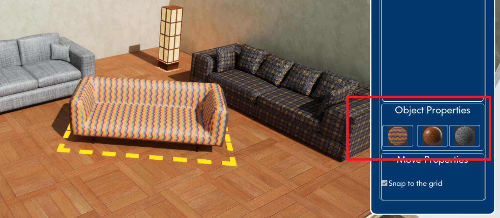

# YKAE-SceneDesignerApp
 

## Main Features

### Place Three types of objects into scene

### Selection of object

### Move Placed objects in the scene with option (which can be enabled/desabled grid snap)

### Change Materials of placed objects

Selected object opens material panel automatically

### Delete placed objects [Delete button]

### Save/Load scene designs

### New project

## Additional Features

### Moveable objects collision detection. If object is released while colliding, it returns in place from which it was draged of.

### Rotate selected object (it can be saved with save design)

### Change room dimensions (it can be saved with save design)

### Change room meterial (it can be saved with save design)

